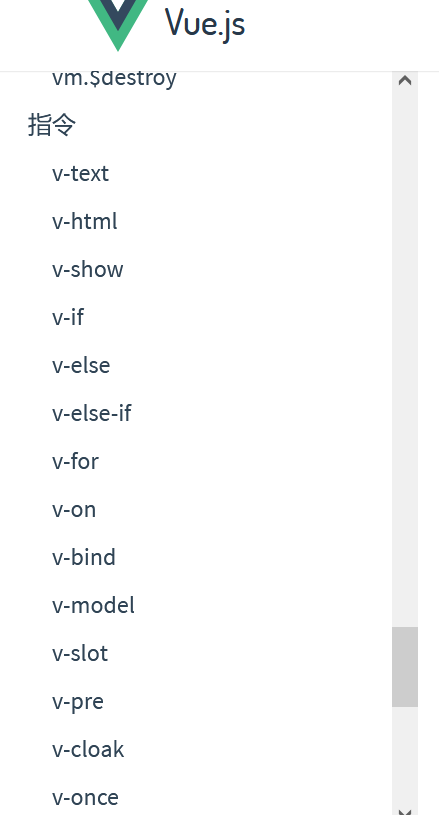

####                                                       Vue积累

##### 1、初见vue:

​    vue是一套用于构建用户界面的渐进式的JavaScript框架。

（1）准备一个dom容器: 

```js
<div id="root">
  <h1>HelloWorld</h1>
  </div>
```

  (2)创建Vue实例:

```js
new Vue({
    el:"#root",
    data:{
        name:你好世界!!
    }
})
```

注意：vue实例与容器是一 一对应关系。

##### 2、vue模板语法:

（1）插值语法：

​                 作用：用于解析标签体内容。

​                 用法：{{ ....}}       双大括号中是js表达式,使用插值语法可以直接读取到data中的所有属性。

```vue
<h1>{{你好!}}</h1>
<span>{{未来!}}</span>
<div>{{哈哈哈!}}</div>
<p>比尔盖茨</p>

```

（2）指令语法:

​              作用：用于解析标签（包括：标签属性、标签体内容、绑定事件）

```vue
<a v-bind:href = "tablelist.url" x="hello">跳转</a>
```

还有许多指令语法：

v-if、v-html、v-show等。可以去vue的官网API查看：https://cn.vuejs.org/v2/api/




##### 3、数据绑定:

 vue中有两种数据绑定的方式:

(1)单向数据绑定：使用v-bind指令，数据只能由vue实例的data流向页面。

(2)双向数据绑定:使用v-model指令，数据在页面与vue实例中是双向的，页面中数据变化，vue实例中的数据也相应的发生相应变化.

```vue
注意：双向数据绑定一般都用在表单元素上，比如说：input、select
----如果v-model绑定的是value那么可以简写为v-model,因为v-model默认收集的就是value值。
```

例子：

```vue


<template>
<div>
    <!-- 写法1-->
    <input type="text" v-bind:value="name">
    <input type="text" v-model:value="name">
    <!--简写-->
    <input type="text" :value="name">
    <input type="text" v-model="name">
</div>
</template>
```

```vue
特别注意：
 如下代码是错误的，因为v-model只能应用在表单类元素（输入类元素）上 
<h2 v-model:x="name">西游记</h2> 
```


##### 4、el与data的两种写法：

(1)el

```vue
const v = new Vue({
		//el:'#root', //第一种写法
			data:{
				name:'尚硅谷'
			}
		})

//==========
v.$mount('#root') //第二种写法
```

(2)data

```vue
		new Vue({
			el:'#root',
			//data的第一种写法：对象式
			 data:{
				name:'马云'
			} 
//============================
			//data的第二种写法：函数式
			data(){
				return{
					name:'马化腾'
				}
			}
		})


注意：对于组件时，必须使用函数式创建vue实例，否则会报错。
```

===重要的原则：由Vue管理的函数，一定不要写箭头函数，一旦写了箭头函数，this就不再是Vue实例了。

##### 5、MVVM模型:

```vue
1. M：模型(Model) ：data中的数据
2. V：视图(View) ：模板代码
3. VM：视图模型(ViewModel)：Vue实例
```

1.data中的所有的属性，最后都出现在了vm身上,vm身上的所有的属性 及 Vue原型上所有属性，在Vue模板中都可以直接使用。

##### 6、数据代理:

##### 7、事件处理:

  事件的使用：

（1）使用v-on: showevent   或者使用@showevent,其中showevent是事件名，可以自定义。

```vue
注意：
  1.事件的回调需要配置在methods对象中，最终会落到vm身上。
  2.methods中配置的函数，不要使用箭头函数，不然this的指向就不是vm 了
  3.methods中配置的函数，都是被Vue所管理的函数，this的指向是vm 或 组件实例对象；
  5.@click="demo" 和 @click="demo($event)" 效果一致，但后者可以传参；
```

例子：

```vue
<template>
   <div>
       <button @click="showinfo1">点我1</button>
       <button @click="showinfo2($event,88)">点我2</button>
   </div>
</template>
<script>
export default {
  name: "learnevent",,
    data(){
	   return{
	   name:'马化腾'
		     }
		  }
        methods: {
            showinfo1(){
                console.log("===one");
            },
            showinfo2(event,number){
                console.log("====two");
                console.log("接收到的参数:",event,number);
            }
        }
      },
</script>
<style scoped lang="scss">
</style>
```


事件的修饰符：

   Vue中的事件修饰符有：

- ​       prevent:  用来阻止默认事件
- ​       stop：用来阻止事件的冒泡
- ​       once:   让事件只触发一次
- ​      capture: 使用事件的捕获模式
- ​      self:   只有event.target是当前操作的元素时才触发事件
- ​       passive:事件的默认行为立即执行，无需等待事件回调执行完毕；


例子：

```
//阻止默认事件,当点击后，并不会跳转。
<a href="http://www.baidu.com" @click.prevent="showInfo">点我提示信息</a>

showInfo(){
  console.log("====我被执行了!");
}

...........

```

键盘事件：

```
vue中常用的按键别名：
     回车 => enter 
     删除 => delete (捕获“删除”和“退格”键)
     退出 => esc
     空格 => space
     换行 => tab (特殊，必须配合keydown去使用)
     上 => up
     下 => down
     左 => left
     右 => right
```

注意：

- ​     @keydown     键盘按下时触发
- ​     @keypress      键盘按住时触发
- ​     @keyup          键盘弹起时触发

```
//例子，当光标移入输入框内，按下回车时，触发弹框。
<input type="text" placeholder="按下回车提示输入" @keydown.enter="showInfo">

showInfo(e){
     alert("i am good boy");
   }
```


##### 8、计算属性(computed):

  Vue给我们提供了一个计算属性Computed, 计算属性中的方法也是函数, 但是跟方法不同,  计算数据会将计算的结果挂载到Vue实例对象的属性上. 这样每次调用的时候,都是在调用Vue实例的属性, 计算的结果就得到了缓存,每次使用属性值就可以了.

 **computed可定义一些函数，这些函数叫做【计算属性】**

**只要data里面的数据发生变化computed会同步改变**

**引用【计算属性】时不要加 () ，当做普通属性使用**

```
例如：
 console.log(this.computedName);
```

computed用的最多的是在模板：

​      如果页面中放入太多声明式逻辑，会让模板非常臃肿。尤其是在页面中大量使用复杂的逻辑表达式来处理数据，会对页面的可维护性造成很大的影响，这是vue极不推荐的。

所以vue就设计了computed来解决此类问题。

```
//例如：
<div id="root">
姓：<input type="text" v-model="firstName"> <br/><br/>
名：<input type="text" v-model="lastName"> <br/><br/>
全名：<span>{{firstName}}-{{lastName}}</span>
</div>

```


##### 9、监视属性:

##### 10、绑定样式:

##### 11、条件渲染:

##### 12、列表渲染:

##### 13、收集表单数据:

##### 14、过滤器:

##### 15、内置指令:

##### 16、自定义指令:

##### 17、生命周期:

##### 18、非单文件组件:

##### 19、单文件组件:

