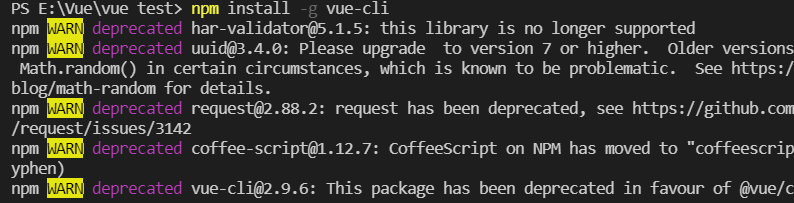
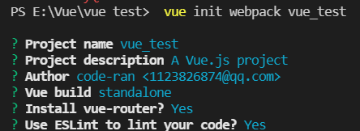
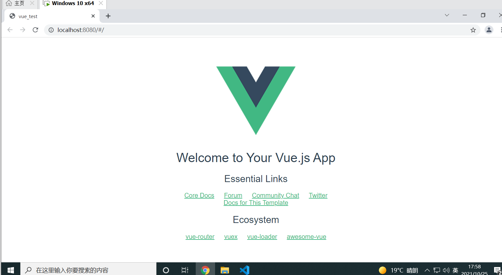
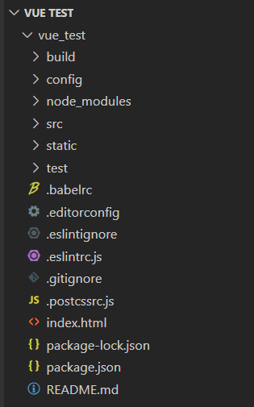

###                                  在VScode中构建Vue项目

1、环境装备：vscode、node.js、npm(node.js自带)

​       安装cnpm:

```
npm install -g cnpm –registry=http://registry.npm.taobao.org

```

2、安装vue-cli脚手架构建工具：

```
npm install -g vue-cli
```



3、安装vscode插件:

（1）ESLint

   (2)  Vetur

   (3)   ES6

4、初始化vue

```
vue init webpack vue_test
```



只需回车即可。

然后再按要求输入：

```
cd vue_test

npm run dev
```

打开浏览器地址即可进行访问。




构建后的vue目录结构：

